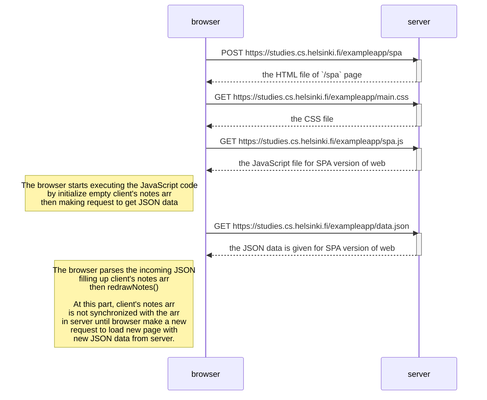

# Exercise 0.5: Single page app
This is a sequence diagram that shows the sequence of events when user accessing page in the `https://studies.cs.helsinki.fi/exampleapp/spa` page.
  
By: Rachmat Purwa Saputra

