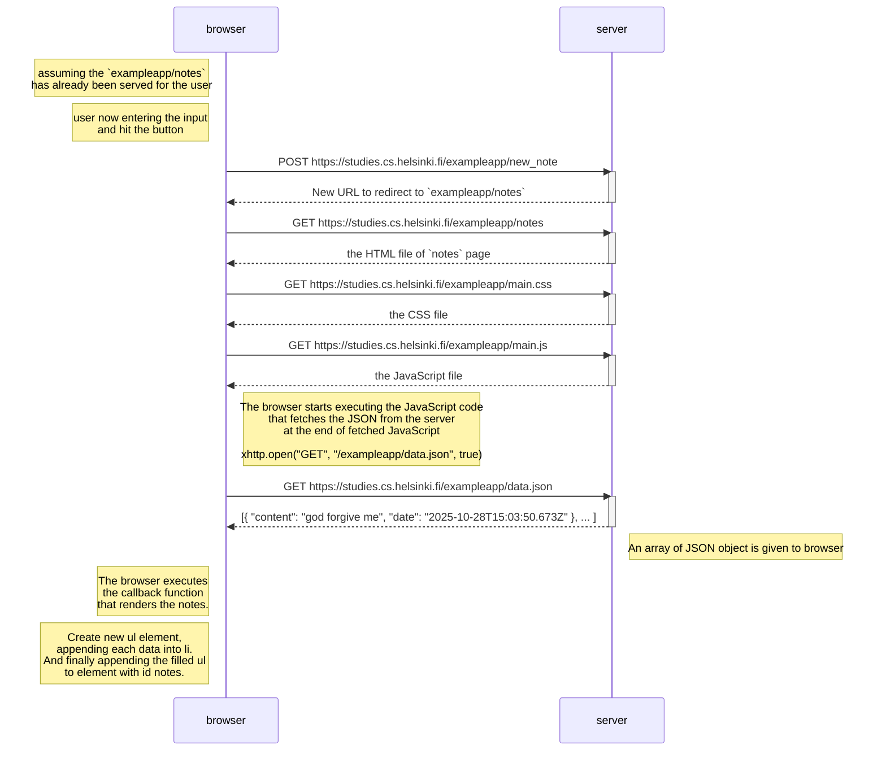

# Exercise 0.4: New note diagram
This is a sequence diagram that shows the sequence of events when user adding a new note in the `https://studies.cs.helsinki.fi/exampleapp/notes` page.
  
By: Rachmat Purwa Saputra

